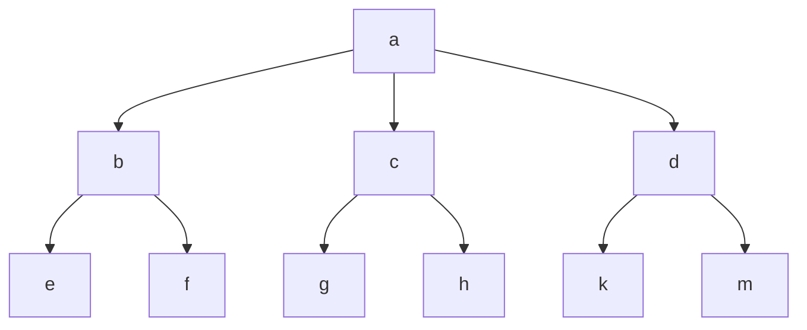

# <center>《Jtyoui》库使用操作手册</center>

# 安装方法

## 1、pip下载方法

```python
pip install jtyoui --user --upgrade
```

## 2、代码安装

```python
git clone https://github.com/jtyoui/Jtyoui.git
pip install twine
python setup.py bdist_wheel
pip install dist/* --upgrade --user
```

# 使用方法

## 1、algorithm算法模块

### 1.1、MatchingAlgorithm

#### 1.1.1、RMMA算法

1. 算法概述

   > 逆向最大匹配算法：通常简称为RMM法。RMM法的基本原理与MM法相同 ,不同的是[分词](https://baike.baidu.com/item/分词)[切分](https://baike.baidu.com/item/切分)的方向与MM法相反，而且使用的分词辞典也不同。逆向最大匹配法从被处理文档的末端开始匹配扫描，每次取最末端的2i个[字符](https://baike.baidu.com/item/字符)（i字字串）作为匹配字段，若匹配失败，则去掉匹配字段最前面的一个字，继续[匹配](https://baike.baidu.com/item/匹配)。相应地，它使用的分词词典是逆序词典，其中的每个词条都将按逆序方式存放。在实际处理时，先将文档进行倒排处理，生成逆序文档。然后，根据逆序词典，对逆序文档用正向最大匹配法处理即可。

2. 代码使用

   ```python
   from jtyoui.algorithm.MatchingAlgorithm import RMMA
   
   if __name__ == '__main__':
       r = RMMA(ls=['我们', '野生', '动物园', '在野'], sort=True)
       print(r.cut(line='我们在野生动物园玩', max_length=3))
    	# ['我们', '在', '野生', '动物园', '玩']
   ```

3. 输入参数

   |    参数    |                 类型                 | 是否必填 | 意义                 |
   | :--------: | :----------------------------------: | -------- | -------------------- |
   |     ls     | 可迭代对象，比如：列表、元组、集合等 | 是       | 匹配词典             |
   |    sort    |       Boolean类型，默认是False       | 否       | 是否要对词典进行排序 |
   |    line    |              字符串类型              | 是       | 需要分割的字符串     |
   | max_length |               整数类型               | 是       | 最长分割字符串长度   |
   
4. 输出讲解

   > 返回按词典切割的字符串

#### 1.1.2、FMMA算法

1. 算法概述

   > 正向最大匹配算法：从左到右将待分词文本中的几个连续字符与词表匹配，如果匹配上，则切分出一个词。但这里有一个问题：要做到最大匹配，并不是第一次匹配到就可以[切分](https://baike.baidu.com/item/切分)的 。

2. 代码使用

   ```python
   from jtyoui.algorithm.MatchingAlgorithm import FMMA
   
   if __name__ == '__main__':
       r = FMMA(ls=['我们', '野生', '动物园', '在野'], sort=True)
       print(r.cut(line='我们在野生动物园玩', max_length=3))
       # ['我们', '在野', '生', '动物园', '玩']
   ```

3. 输入参数

   |    参数    |                 类型                 | 是否必填 | 意义                 |
   | :--------: | :----------------------------------: | -------- | -------------------- |
   |     ls     | 可迭代对象，比如：列表、元组、集合等 | 是       | 匹配词典             |
   |    sort    |       Boolean类型，默认是False       | 否       | 是否要对词典进行排序 |
   |    line    |              字符串类型              | 是       | 需要分割的字符串     |
   | max_length |               整数类型               | 是       | 最长分割字符串长度   |

4. 输出讲解

   > 返回按词典切割的字符串

#### 1.1.3、kmp算法

1. 算法概述

   > 无回溯串匹配算法：是一种改进的[字符串匹配](https://baike.baidu.com/item/字符串匹配)算法，由D.E.Knuth，J.H.Morris和V.R.Pratt提出的，因此人们称它为[克努特](https://baike.baidu.com/item/克努特)—[莫里斯](https://baike.baidu.com/item/莫里斯)—[普拉特](https://baike.baidu.com/item/普拉特)操作（简称KMP算法）。KMP算法的核心是利用匹配失败后的信息，尽量减少模式串与主串的匹配次数以达到快速匹配的目的。具体实现就是通过一个next()函数实现，函数本身包含了模式串的局部匹配信息。KMP算法的[时间复杂度](https://baike.baidu.com/item/时间复杂度)O(m+n)。

2. 代码使用

   ```python
   from jtyoui.algorithm.MatchingAlgorithm import kmp
   if __name__ == '__main__':
       print(kmp(string='我们在野生动物园玩', str_='动物园'))
       # 5
   ```

3. 输入参数

   |  参数  |  类型  | 是否必填 |       意义       |
   | :----: | :----: | :------: | :--------------: |
   | string | 字符串 |    是    | 需要匹配的字符串 |
   |  str_  | 字符串 |    是    |  待匹配的字符串  |

4. 返回讲解

   > 返回匹配到字符串的索引，如果找不到返回-1

#### 1.1.4、max_sub_array算法

 1. 算法概述

    > 求解最大子数组算法：给定一串数字，找到连续数字里面的最大值算法。

2. 代码使用

    ```python
    from jtyoui.algorithm.MatchingAlgorithm import max_sub_array
    
    if __name__ == '__main__':
        print(max_sub_array(ls=[5, 4, -12, 1, 3, -1, 4, 1, -6]))
        # (0, 1, 9)
    ```

3. 输入参数

    | 参数 |              类型              | 是否必填 |     意义     |
    | :--: | :----------------------------: | :------: | :----------: |
    |  ls  | 可迭代对象，比如：列表、元组等 |    是    | 一串数字数组 |

4. 输出讲解

    > 返回三元组（起始位置、结束位置、最大值），比如（0，1，9）--> ls[0:1+1]==9 是最大子串

### 1.2、MillerRabin

#### 1.2.1、miller_rabin_prime算法

1. 算法概述

   > 米勒-拉宾素性检验是一种素数判定法则，利用随机化算法判断一个数是合数还是可能是素数。
   > 卡内基梅隆大学的计算机系教授Gary Lee Miller首先提出了基于广义黎曼猜想的确定性算法，
   > 由于广义黎曼猜想并没有被证明，其后由以色列耶路撒冷希伯来大学的Michael O. Rabin教授作出修改，
   > 提出了不依赖于该假设的随机化算法。

2. 代码使用

   ```python
   from jtyoui.algorithm.MillerRabin import miller_rabin_prime
   
   if __name__ == '__main__':
       print(miller_rabin_prime(n=12026655772210679470465581609002, k=100))
       # False
   ```

3. 输入参数

   | 参数 |    类型     |   是否必填   |      意义      |
   | :--: | :---------: | :----------: | :------------: |
   |  n   | 大于1的整数 |      是      | 判断是否是质数 |
   |  k   | 大于1的整数 | 否，默认是50 | 进行多少次判断 |

4. 输出讲解

   > 返回bool类型，如果是True说明该数k是质数，否则不是质数。

#### 1.2.2、random_big_prime算法

1. 算法概述

   > 随机产生大质数：利用筛选米勒-拉宾素性检验的方法来随机生成大质数

2. 代码使用

   ```python
   from jtyoui.algorithm.MillerRabin import random_big_prime
   
   if __name__ == '__main__':
       print(random_big_prime(n=30))
   	# 256830052945093268851651746541
   ```

3. 输入参数

   | 参数 |    类型     |   是否必填   |       意义       |
   | :--: | :---------: | :----------: | :--------------: |
   |  n   | 大于0的整数 | 否，默认是15 | 返回多少位的质数 |

4. 输出讲解

   > 返回n位大质数，n的取值范围是[1,9007199254740992]。也就是1到2**53的范围。理论上是这样的。

### 1.3、ReplaceAlgorithm

#### 1.3.1、map_replace算法

1. 算法概述

   > 映射替换算法：用一个字符替换另一个字符。类似与raplace函数，不过该方法支持字典映射，类似于key-value形式。key-value形式只支持单字符串映射，maps都支持。

2. 代码使用

   ```python
   from jtyoui.algorithm.ReplaceAlgorithm import map_replace
   
   if __name__ == '__main__':
       print(map_replace(str_='[中国]', key='[]', value='【】'))
       # 【中国】
       
       d = {
           '[': '【',
           ']': '】'
       }
       print(map_replace(str_='[中国]', maps=d))
       # 【中国】
   ```

3. 输入参数

   | 参数  |  类型  | 是否必填 |       意义       |
   | :---: | :----: | :------: | :--------------: |
   | str_  | 字符串 |    是    | 需要替换的字符串 |
   |  key  | 字符串 |    否    |  原字符串的字符  |
   | value | 字符串 |    否    |   替换后的字符   |
   | maps  |  字典  |    否    |     映射替换     |

   【注意】当key为空时，value必为空，key和value要么一起为空，要么一起有值。当key和value都为空时，maps一定有值。key、value、maps三个参数不能同时为空。如果三个参数都有值，实际上会执行maps映射替换，使用maps映射替换，但是效率低。如果是单字符替换，建议使用key，value参数形式。单字符的意思是字符的长度为1，多字符长度大于1。

4. 输出讲解

   >返回字符串类型，返回替换后的字符串。

### 1.4、SearchAlgorithm

#### 1.4.1、binary_search算法

1. 算法概述

   >二分查找也称折半查找（Binary Search），它是一种效率较高的查找方法。但是，折半查找要求线性表必须采用顺序存储结构，而且表中元素按关键字有序排列。

2. 代码使用

   ```python
   from jtyoui.algorithm.SearchAlgorithm import binary_search
   
   if __name__ == '__main__':
       s = [1, 2, 3, 4, 5, 6, 10, 7]
       print(binary_search(ls=s, x=7, sort=True))
       # True
       s = ['a', 'b', 'c']
       print(binary_search(ls=s, x='a', sort=True))
       # True
   ```

3. 输入参数

   | 参数 |                             类型                             | 是否必填 |         意义         |
   | :--: | :----------------------------------------------------------: | :------: | :------------------: |
   |  ls  |                         x查询的列表                          |    是    |     要查询的列表     |
   |  x   | 如果列表是数值类型，那么x也是数值类型。如果列表是字符串类型，那么x也是字符串类型。 |    是    |       查询的值       |
   | sort |                           bool类型                           |    否    | 是否要对列表进行排序 |

4. 输出讲解

   > 返回是否查询到，返回True说明查询成功，否则失败！

### 1.5、SortAlgorithm

#### 1.5.1、bubbled_sort算法

1. 算法概述

   > 冒泡排序（Bubble Sort），是一种[计算机科学](https://baike.baidu.com/item/计算机科学)领域的较简单的[排序算法](https://baike.baidu.com/item/排序算法/5399605)。
   >
   > 它重复地走访过要排序的元素列，依次比较两个相邻的元素，如果顺序（如从大到小、首字母从从Z到A）错误就把他们交换过来。走访元素的工作是重复地进行直到没有相邻元素需要交换，也就是说该元素列已经排序完成。
   >
   > 这个算法的名字由来是因为越小的元素会经由交换慢慢“浮”到数列的顶端（升序或降序排列），就如同碳酸饮料中二氧化碳的气泡最终会上浮到顶端一样，故名“冒泡排序”。

2. 代码使用

   ```python
   from jtyoui.algorithm.SortAlgorithm import bubbled_sort
   
   if __name__ == '__main__':
       import random
   
       jr = [random.randint(0, 1000) for _ in range(10)]
       bs = bubbled_sort(ls=jr)
       print(bs)
   	# [58, 155, 176, 295, 351, 468, 533, 656, 761, 923]
   ```

3. 输入参数

   | 参数 | 类型 | 是否必填 |      意义      |
   | :--: | :--: | :------: | :------------: |
   |  ls  | 列表 |    是    | 需要排序的列表 |

4. 输出讲解

   > 返回排序好的列表

### 1.6、TreeAlgorithm

#### 1.6.1、dict_create_tree算法

1. 算法概述

   > 根据字典类型，创建一颗树，比如下面这种类型:



   >
   > 用字典表示的话应该是： {'a': {'b': ['e', 'f'], 'c': ['g', 'h'], 'd': ['k', 'm']}}
   >
   > 现在将该字典转为一颗树型结构

2. 代码使用

   ```python
   from jtyoui.algorithm.TreeAlgorithm import dict_create_tree
   
   if __name__ == '__main__':
       print('----------------------创建树-------------------------------')
       ds = {'a': {'b': ['e', 'f'], 'c': ['g', 'h'], 'd': ['k', 'm']}}
       ts = dict_create_tree(data=ds)
       print(ts)
       # <jtyoui.algorithm.TreeAlgorithm.Tree object at 0x000001D8724F50C8>
   
       print('--------------------搜索树对象---------------------------------')
       tree_object = []
       ts.search_tree(value='g', ls=tree_object)
       print(tree_object)
       # [<jtyoui.algorithm.TreeAlgorithm.Tree object at 0x000001D870FB92C8>]
   
       print('---------------------打印路径------------------------------------')
       print(tree_object[0].node_parent_value())
       # a-c-g
   
       print('-----------------------搜索树的路径-------------------------')
       for i in ts.search_tree_value(value='g'):
           print(i)
           # a-c-g
   ```

3. 输入参数

   | 参数  |  类型  | 是否必填 |       意义       |
   | :---: | :----: | :------: | :--------------: |
   | data  |  字典  |    是    |     树型字典     |
   | value | 字符串 |    是    |  搜索树支上的值  |
   |  ls   |  列表  |    是    | 保存一条树枝对象 |

4. 输出讲解

   > 返回一颗树，支持搜索树的路径。采用了多叉搜索树的算法。

## 2、baidu算法模块

